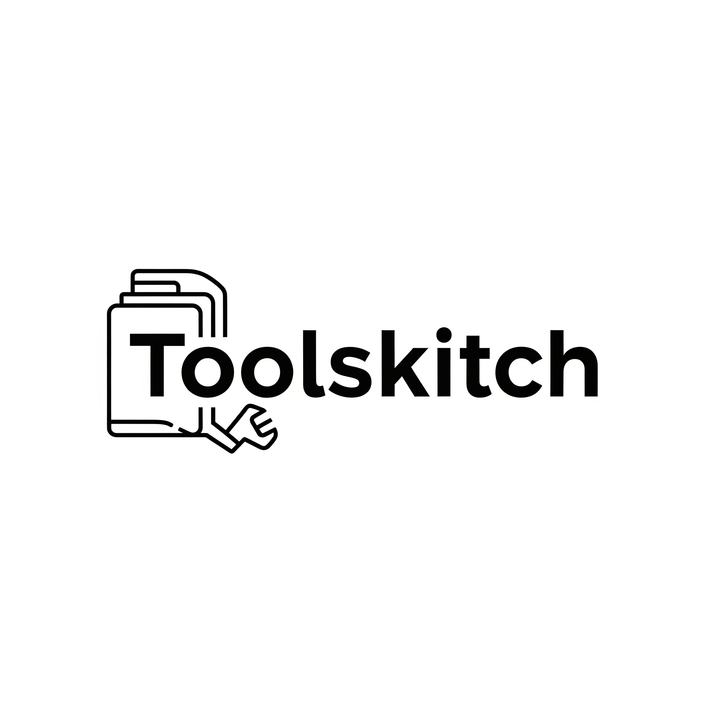

# Toolskitch - Customer Perspective Simulator
[](LICENSE)
[](./SECURITY.md)


<div align="center">
  
  <br>
  <em>See your application through your customer's eyes! 👀</em>
</div>

---

## 🎯 **What is Toolskitch?**

A desktop application that allows programmers to simulate and record customer interactions with their web applications, helping them understand the user experience from a customer's perspective.

## ✨ **Key Features**

### 🎯 **Customer Perspective Simulation**

- Embedded web browser to view your application as a customer would
- Clean interface without developer tools or technical clutter
- Real-time navigation and interaction

### 📹 **Session Recording**

- Record all user interactions (navigation, clicks, form inputs)
- Save sessions to JSON files for later analysis
- Timestamped events for precise replay

### 🔄 **Session Replay**

- Load and replay recorded sessions
- Step-through playback of customer interactions
- Visual feedback during replay process

### 📊 **Session Logging**

- Real-time log of all recorded events
- Detailed timestamps and event descriptions
- Easy debugging and analysis

## 🚀 **Quick Start**

### **Prerequisites**

- Python 3.7 or higher
- Windows 10/11

### **Installation**

1. **Install Python dependencies:**

   ```bash
   pip install -r requirements.txt
   ```

2. **Run the application:**

   ```bash
   python main.py
   ```

   **Or use the easy launcher:**

   ```bash
   run_toolskitch.bat
   ```

## 📖 **How to Use**

### **1. Start the Application**

- Launch `main.py` to open Toolskitch
- The application window will appear with a URL bar and embedded browser

### **2. Navigate to Your Web App**

- Enter your web application's URL in the address bar
- Press Enter or click the navigation buttons
- The web app will load in the embedded browser

### **3. Record a Customer Session**

- Click **"Start Recording"** to begin capturing interactions
- Navigate through your application as a customer would
- All interactions (clicks, navigation, form inputs) are automatically recorded
- Click **"Stop Recording"** when finished

### **4. Save Your Session**

- After stopping the recording, click **"Save Session"**
- Choose a location and filename for your session file
- Sessions are saved as JSON files for easy sharing and analysis

### **5. Replay Sessions**

- Click **"Load Session"** to open a previously saved session
- Click **"Start Replay"** to watch the recorded interactions
- The application will automatically replay all recorded actions
- Monitor the session log for detailed progress

## 🎯 **Use Cases**

### **User Experience Testing**

- Record typical customer journeys through your application
- Identify pain points and confusing interfaces
- Test different user scenarios and workflows

### **Bug Reproduction**

- Record steps to reproduce customer-reported issues
- Share exact reproduction steps with your development team
- Maintain detailed records of customer interactions

### **Usability Analysis**

- Analyze how customers actually use your application
- Compare intended vs. actual user flows
- Identify areas for improvement in your UI/UX

### **Training and Documentation**

- Create training materials with real customer interactions
- Document common user workflows
- Share customer perspective with stakeholders

## 📁 **Project Structure**

```
toolskitch/
├── main.py                    # Main application file
├── logo.png                   # Application logo
├── logo.ico                   # Windows icon file
├── requirements.txt           # Python dependencies
├── README.md                 # This file
├── run_toolskitch.bat        # Easy Windows launcher
├── install_dependencies.bat   # Dependency installer
├── create_icon.py            # PNG to ICO converter
├── clear_icon_cache.bat      # Icon cache clearing
├── fix_taskbar_icon.bat      # Taskbar icon fix
├── config.json               # Application configuration
└── sessions/
    └── example_session.json  # Sample session file
```

## 🔧 **Configuration**

The application uses `config.json` for settings:

```json
{
  "application": {
    "name": "Toolskitch",
    "version": "1.0.0"
  },
  "ui": {
    "window_size": {
      "width": 1200,
      "height": 800
    },
    "default_url": "https://example.com"
  },
  "recording": {
    "auto_save_interval": 30,
    "max_session_duration": 3600
  }
}
```

## 📊 **Session File Format**

Sessions are saved as JSON files with the following structure:

```json
{
  "start_time": "2024-01-15T10:30:00",
  "events": [
    {
      "timestamp": 0.5,
      "type": "navigation",
      "data": {
        "url": "https://example.com/login"
      }
    },
    {
      "timestamp": 2.1,
      "type": "click",
      "data": {
        "x": 150,
        "y": 200
      }
    }
  ]
}
```

## 🛠️ **Troubleshooting**

### **Common Issues**

1. **Application won't start:**

   - Ensure all dependencies are installed: `pip install -r requirements.txt`
   - Check Python version (3.7+ required)

2. **Web pages don't load:**

   - Verify internet connection
   - Check if the URL is correct and accessible
   - Some sites may block embedded browsers

3. **Recording not working:**

   - Ensure you clicked "Start Recording" before interacting
   - Check the session log for recording status
   - Restart the application if issues persist

4. **Taskbar icon not updating:**
   - Run `fix_taskbar_icon.bat` to clear icon cache
   - Restart your computer if the issue persists
   - Check if `logo.ico` file exists in the project directory

### **Performance Tips**

- Close unnecessary browser tabs to improve performance
- Use shorter recording sessions for better replay accuracy
- Save sessions regularly to avoid data loss

## 🔮 **Future Enhancements**

This is a prototype application. Future enhancements could include:

- **Enhanced Event Capture:** Mouse movements, scroll events, keyboard shortcuts
- **Analytics Dashboard:** Visual analysis of user interactions
- **Export Options:** Video export, PDF reports, integration with analytics tools
- **Multi-platform Support:** macOS and Linux versions
- **Cloud Integration:** Save sessions to cloud storage for team sharing

## 📄 **License**

This project is open source and available under the MIT License.

---

<div align="center">
  <strong>Toolskitch</strong> - By Ansh<br>
  <em>Customer Perspective Simulator</em>
</div>
